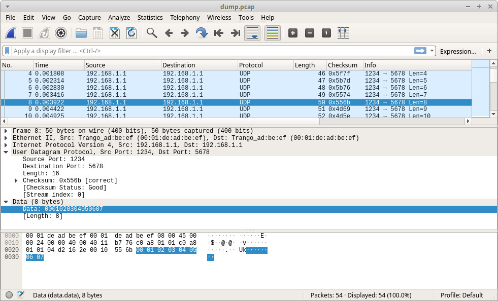

# axis_udp
This repository contains simple implementation of UDP/IP stack with 64-bit AXI-Stream interface. ICMP and ARP requests are partially supported. The project was tested on Xilinx 7-series FPGA with 10G Ethernet MAC IP-core

## Simulation 

Before simulation, you need specify the path to output file with network traffic dump

`axis_udp/tb/udp_tb.sv:`
```verilog
localparam DUMP_PATH = "/home/usr/dump.txt";
```
After simulation, you can use tool `axis2net.py` to convert network traffic dump in `*.pcap` format. Then you can use WireShark to analyze network packets.

```bash
$ python3 axis2net.py /home/usr/dump.txt --o /home/usr/dump.pcap
```

